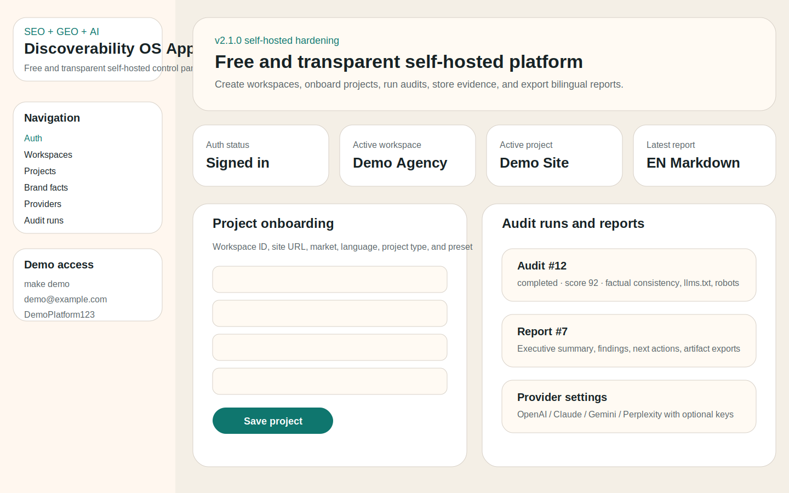
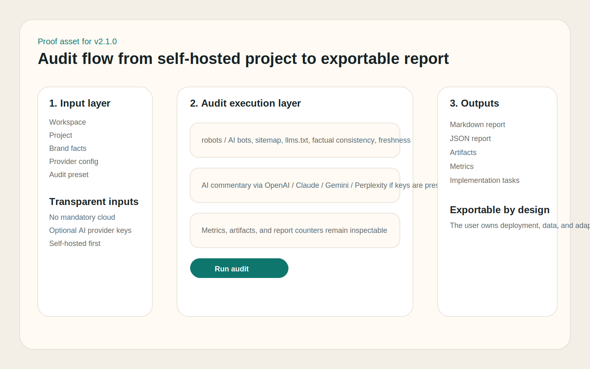
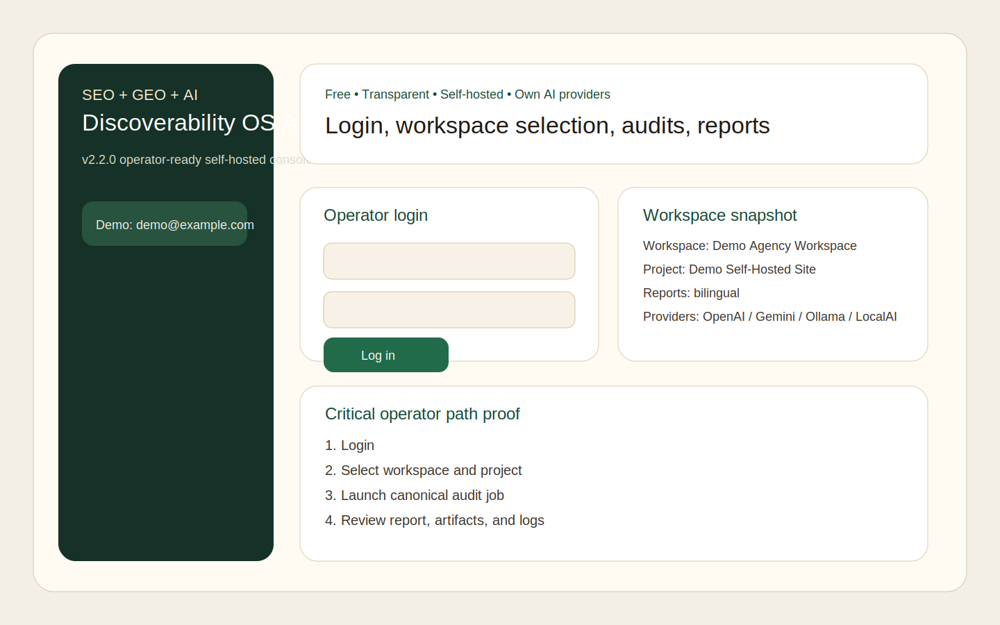
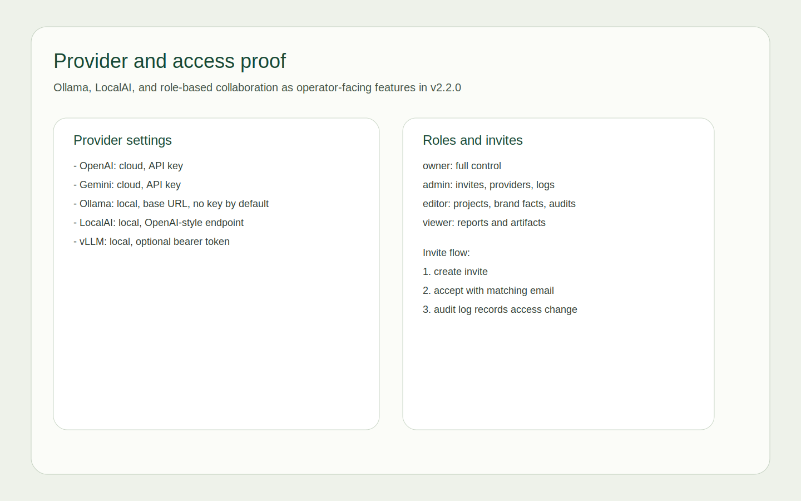

# SEO + GEO + AI Discoverability OS

[](https://github.com/Gudvin82/seo-geo-ai-roadmap/tags)
[](./LICENSE)
[](https://github.com/Gudvin82/seo-geo-ai-roadmap/commits/main)
[](https://github.com/Gudvin82/seo-geo-ai-roadmap/actions/workflows/markdown-lint.yml)
[](https://github.com/Gudvin82/seo-geo-ai-roadmap/actions/workflows/script-smoke-tests.yml)
[](https://github.com/Gudvin82/seo-geo-ai-roadmap/actions/workflows/python-tests.yml)
[](https://github.com/Gudvin82/seo-geo-ai-roadmap/actions/workflows/docs-site.yml)


Free, transparent, self-hosted, and ready for your own AI providers. Deploy it
for yourself or your clients to audit, improve, monitor, and manage SEO, GEO,
and AI discoverability.

[Русская версия](./README_RU.md)

## v2.2.0 positioning

A free and transparent self-hosted platform you can deploy for yourself or your
clients to audit, improve, monitor, and manage SEO, GEO, and AI discoverability.

Core principles:

- no mandatory paid cloud
- no mandatory subscription
- no vendor lock-in
- self-hosted first
- transparent checks and outputs
- own AI providers or local LLM runtimes
- exportable reports, artifacts, and data

## Why this repository exists

This project is built as an execution-first framework for teams that need one practical system across classic SEO, GEO, AI discoverability, Yandex, content operations, governance, reporting, and release discipline.

## Differentiators

- Bilingual by design: English and Russian are both first-class layers, not a translated afterthought.
- Google + Yandex + LLM in one framework: global search, Russian-speaking markets, and AI surfaces are handled together.
- Execution-first structure: docs, checklists, prompts, templates, scripts, and examples reinforce each other.
- AI-native layer: `llms.txt`, AI bots, answer-ready content, hallucination fixes, and AI share-of-voice monitoring are built in.
- Governance-ready: RACI, Definition of Done, implementation roadmap, release process, and reporting templates are included.
- Discoverability framing: the repository treats visibility as a system wider than SEO alone.

## Who it is for

- In-house SEO, growth, and content teams
- Agencies serving both RU/CIS and global markets
- Founders and operators building multilingual lead generation websites
- Teams that need practical SOPs instead of theoretical SEO checklists

## What is inside

- Deep bilingual docs in [`docs/en`](./docs/en) and [`docs/ru`](./docs/ru)
- Operational checklists in [`checklists`](./checklists)
- Prompt library in [`prompts`](./prompts)
- Reusable templates in [`templates`](./templates)
- Validation and helper scripts in [`scripts`](./scripts)
- Full script usage docs in [`scripts/README.md`](./scripts/README.md)
- Pytest coverage for key helpers in [`tests`](./tests)
- SaaS-ready app layer in [`app`](./app)
- Self-hosted deployment foundation in [DEPLOYMENT.md](./DEPLOYMENT.md)
- Deployment verification in [VERIFY_DEPLOYMENT.md](./VERIFY_DEPLOYMENT.md)
- Known limitations in [KNOWN_LIMITATIONS.md](./KNOWN_LIMITATIONS.md)
- Operations runbook in [OPERATIONS_RUNBOOK.md](./OPERATIONS_RUNBOOK.md)
- Product architecture docs in [ARCHITECTURE.md](./ARCHITECTURE.md)
- Filled samples in [`examples`](./examples)
- Glossaries in [GLOSSARY.md](./GLOSSARY.md) and
  [GLOSSARY_RU.md](./GLOSSARY_RU.md)
- Positioning, governance, ecosystem, and release documentation in the repository root
- Optional environment contract in [`.env.example`](./.env.example)
- Real implementation notes in [REAL_CASES.md](./REAL_CASES.md)

## Quick start

1. Read [POSITIONING.md](./POSITIONING.md) and [DIFFERENTIATORS.md](./DIFFERENTIATORS.md).
2. Start from [docs/en/01-audit.md](./docs/en/01-audit.md).
3. Build the page plan with [docs/en/04-page-matrix.md](./docs/en/04-page-matrix.md).
4. Implement AI visibility with [docs/en/08-geo-ai-search.md](./docs/en/08-geo-ai-search.md).
5. Set reporting discipline with [docs/en/18-analytics.md](./docs/en/18-analytics.md) and [ROADMAP.md](./ROADMAP.md).

## App quickstart

- Frontend: `http://localhost:3000`
- API docs: `http://localhost:8000/docs`
- ReDoc: `http://localhost:8000/redoc`
- Health: `http://localhost:8000/healthz`
- Readiness: `http://localhost:8000/readyz`
- Metrics: `http://localhost:8000/metrics`

Useful entrypoints:

- [DEPLOYMENT.md](./DEPLOYMENT.md)
- [SECURITY_CHECKLIST.md](./SECURITY_CHECKLIST.md)
- [VERIFY_DEPLOYMENT.md](./VERIFY_DEPLOYMENT.md)
- [START_HERE_FOR_AI.md](./START_HERE_FOR_AI.md)
- [CLIENT_SETUP_PLAYBOOK.md](./CLIENT_SETUP_PLAYBOOK.md)
- [AI_HANDOFF_PROMPT.md](./AI_HANDOFF_PROMPT.md)
- [docs/en/api-reference.md](./docs/en/api-reference.md)
- [docs/en/ai-operator-mode.md](./docs/en/ai-operator-mode.md)
- [docs/en/roles-and-invites.md](./docs/en/roles-and-invites.md)
- [docs/en/patch-mode.md](./docs/en/patch-mode.md)
- [docs/en/cms-connectors.md](./docs/en/cms-connectors.md)
- [SELF_HOSTED_USE_CASES.md](./SELF_HOSTED_USE_CASES.md)

Verification command:

- `make verify-demo`
- `make agent-self-check`
- `make turnkey-demo`

## For AI coding agents

If you are using Codex, Claude Code, Cursor, or other AI coding agents, start
from [AGENTS.md](./AGENTS.md). It is the dedicated entrypoint for agents and
explains how to work end to end inside this repository.

AGENTS.md gives agents:

- task routing for common turnkey requests
- a repo map and the exact entrypoints to read first
- the key scripts to use before inventing new flows
- a short Definition of Done summary
- clarification rules for vague user instructions

## Proof and examples

- Real-world implementation patterns: [REAL_CASES.md](./REAL_CASES.md)
- Repo walkthrough: [WALKTHROUGH.md](./WALKTHROUGH.md)
- Canonical facts guidance:
  [docs/en/canonical-facts-and-entity-consistency.md](./docs/en/canonical-facts-and-entity-consistency.md)
- Entity hierarchy guidance:
  [docs/en/entity-hierarchy-and-brand-focus.md](./docs/en/entity-hierarchy-and-brand-focus.md)
- Brand facts starter: [templates/brand-facts-template.md](./templates/brand-facts-template.md)
- Hallucination monitoring starter:
  [examples/hallucination-report-example.md](./examples/hallucination-report-example.md)

### Product proof






## What this repo already powers

- product-led audit service architecture
- expert-led AI discoverability hubs
- bilingual SEO + GEO + AI execution workflows
- factual consistency and entity-governance operating patterns

## Real-world implementations

See [REAL_CASES.md](./REAL_CASES.md) for high-level patterns based on
`sitepravo.ru`, `auditguard.ru`, and `anmalishev.ru`.

## Example script

The repository includes real helper scripts, not just documentation. One useful
entry point is [`scripts/generate_llms_txt.py`](./scripts/generate_llms_txt.py),
which builds `llms.txt` from a sitemap.

### Generate llms.txt from sitemap

```bash
python scripts/generate_llms_txt.py \
  --sitemap-url https://example.com/sitemap.xml \
  --output-file ./llms.txt
```

Sample output:

```text
Processed URLs: 42
Output file: llms.txt
Warnings:
- Review description for https://example.com/solutions/ai-ops
```

See [scripts/README.md](./scripts/README.md) for full CLI usage examples.

## ROI visibility

- ROI calculator: [`scripts/roi_calculator.py`](./scripts/roi_calculator.py)
- ROI model template: [templates/roi-model-template.md](./templates/roi-model-template.md)
- ROI example: [examples/roi-calculation-example.md](./examples/roi-calculation-example.md)

## Docs site

- Docs site delivery is configured through GitHub Pages in
  [`.github/workflows/docs-site.yml`](./.github/workflows/docs-site.yml)
- Build runs on every push; deployment is opt-in after Pages is enabled and the
  repository variable `ENABLE_GITHUB_PAGES=true` is set
- Local preview: `pip install mkdocs-material && mkdocs serve`
- The docs-site now includes the app layer, deployment, architecture, and API
  overview

## Demo and self-hosted startup

- `make up` runs the Docker stack
- `make demo` starts the Docker stack and seeds demo data
- `make migrate` runs Alembic migrations
- `make seed` loads demo seed data locally
- `./run-local.sh` prints the minimal local backend + frontend startup flow

Demo credentials after seeding:

- Email: `demo@example.com`
- Password: `DemoPlatform123`

## SaaS app layer

`v2.0.0` introduces the first product layer without replacing the methodology
repository.

What it includes:

- FastAPI backend for auth, workspaces, projects, audits, reports, providers,
  artifacts, and brand facts
- static frontend control panel for core product workflows
- multi-provider AI abstraction for OpenAI, Anthropic/Claude, Gemini, and
  Perplexity
- EN/RU report generation
- Docker Compose deployment for self-hosted usage
- expiring auth tokens, Argon2id password hashing, and basic brute-force protection
- Alembic migrations and demo seed data
- Prometheus-style `/metrics` endpoint

Key docs:

- [ARCHITECTURE.md](./ARCHITECTURE.md)
- [DEPLOYMENT.md](./DEPLOYMENT.md)
- [OPEN_SOURCE_AND_SAAS_BOUNDARY.md](./OPEN_SOURCE_AND_SAAS_BOUNDARY.md)
- [SECURITY_CHECKLIST.md](./SECURITY_CHECKLIST.md)
- [docs/en/provider-matrix.md](./docs/en/provider-matrix.md)
- [docs/en/cloud-deployments.md](./docs/en/cloud-deployments.md)

## Example prompt

Use the `llms.txt` generator prompt when you want an AI assistant to draft a
human-readable `llms.txt` structure before review.

Purpose: turn a sitemap and key pages into a concise `llms.txt` draft.

Input: homepage, service pages, FAQ, about page, and a sitemap.

```text
Role: technical discoverability specialist
Inputs: https://example.com, homepage, service pages, FAQ, about page
Task: produce a production-ready llms.txt draft with concise descriptions
Output format: one line per URL with a short description
Evaluation criteria: conciseness, coverage, canonical discipline
```

## How to use this framework on a real project

1. Run the initial audit with [docs/en/01-audit.md](./docs/en/01-audit.md),
   [checklists/en/technical-seo-checklist.md](./checklists/en/technical-seo-checklist.md),
   and [`scripts/sitemap-checker.py`](./scripts/sitemap-checker.py).
2. Fix technical SEO using
   [docs/en/05-technical-seo.md](./docs/en/05-technical-seo.md) and
   [`scripts/check-robots-ai-bots.py`](./scripts/check-robots-ai-bots.py).
3. Implement GEO / AI visibility with
   [docs/en/08-geo-ai-search.md](./docs/en/08-geo-ai-search.md),
   [`scripts/generate_llms_txt.py`](./scripts/generate_llms_txt.py), and
   [`prompts/en/llms-txt-generator-prompt.md`](./prompts/en/llms-txt-generator-prompt.md).
4. Adapt the system for local or international markets through
   [docs/en/13-russia-yandex.md](./docs/en/13-russia-yandex.md) or
   [docs/en/12-international-seo.md](./docs/en/12-international-seo.md).
5. Improve content and answer extraction with
   [docs/en/07-content-eeat.md](./docs/en/07-content-eeat.md) and
   [prompts/en/answer-ready-page-prompt.md](./prompts/en/answer-ready-page-prompt.md).
6. Track analytics and AI visibility with
   [docs/en/18-analytics.md](./docs/en/18-analytics.md),
   [`scripts/ai-share-of-voice-tracker.py`](./scripts/ai-share-of-voice-tracker.py),
   [examples/ai-share-of-voice-weekly-report.md](./examples/ai-share-of-voice-weekly-report.md),
   and sample data in
   [examples/ai-sov-report-sample.json](./examples/ai-sov-report-sample.json).
7. Govern releases with [docs/en/20-raci.md](./docs/en/20-raci.md),
   [docs/en/21-definition-of-done.md](./docs/en/21-definition-of-done.md), and
   [RELEASE_PROCESS.md](./RELEASE_PROCESS.md).

## Architecture

```text
repo/
├── README.md / README_RU.md
├── POSITIONING.md / DIFFERENTIATORS.md / ECOSYSTEM_MAP.md
├── ROADMAP.md / RELEASE_PROCESS.md / CHANGELOG.md
├── ARCHITECTURE*.md / DEPLOYMENT*.md / OPEN_SOURCE_AND_SAAS_BOUNDARY*.md
├── app/backend / app/frontend / app/shared
├── docker-compose.yml / docker/ / infra/
├── docs/en and docs/ru
├── checklists/en and checklists/ru
├── prompts/en and prompts/ru
├── templates/ and templates/schema
├── scripts/
├── examples/
└── .github/
```

## Ecosystem references

This repository complements, not replaces, adjacent products and platforms. See [ECOSYSTEM_MAP.md](./ECOSYSTEM_MAP.md) for OpenSEO, Perplexica, Open WebUI, Trieve, Onyx, and Flowise.

## Vibe Coding Protocols

For teams and developers who want to combine this discoverability OS with a
more experimental, vibe-first way of building, there is a companion repository:
[Vibe Coding Protocols](https://github.com/Gudvin82/vibe-coding-protocols).

It focuses on:

- lightweight iterative workflows for AI-assisted coding and experimentation
- protocols for live vibecoding sessions in IDEs and terminals
- patterns for combining structured SOPs from this repo with creative exploration

If you prefer to design your SEO + GEO + AI systems while you code and explore
live, Vibe Coding Protocols is a natural add-on.

## Roadmap preview

- Foundation: audit, architecture, page matrix, technical SEO, GEO/AI layer
- Execution: content quality, Yandex/RU specifics, analytics, governance, DoD
- Expansion: AI brand monitoring, international rollout, ongoing release discipline

## Latest changes

- `v1.2.0`: added `AGENTS.md` and agent-first onboarding plus the
  `vibe-coding-protocols` companion link.
- `v1.3.0`: added scripts documentation, glossary, AI SoV sample datasets,
  stronger `llms.txt` validation, and ROI tooling.
- `v1.4.0`: added tests, docs-site delivery, real cases, factual consistency
  guidance, entity hierarchy docs, freshness checking, and hallucination
  monitoring starters.
- `v2.0.0`: added the SaaS app layer, multi-provider AI foundation, structured
  audit workflows, Docker deployment, and EN/RU architecture and deployment
  docs.
- `v2.1.0`: hardens the self-hosted platform with stronger auth security,
  Alembic migrations, demo seed flow, `/metrics`, API reference docs,
  operator-mode docs, and explicit free transparent deployment framing.

## Visibility additions

- See [GLOSSARY.md](./GLOSSARY.md) for core terms used by humans and LLMs.
- See [examples/ai-sov-report-sample.json](./examples/ai-sov-report-sample.json)
  and [examples/ai-sov-report-sample.csv](./examples/ai-sov-report-sample.csv)
  for sample AI Share of Voice data.
- Keep using the companion repo:
  [https://github.com/Gudvin82/vibe-coding-protocols](https://github.com/Gudvin82/vibe-coding-protocols)

## Contributing

Read [CONTRIBUTING.md](./CONTRIBUTING.md), [CONTRIBUTORS.md](./CONTRIBUTORS.md), [CODE_OF_CONDUCT.md](./CODE_OF_CONDUCT.md), and the pull request template in [`.github/PULL_REQUEST_TEMPLATE.md`](./.github/PULL_REQUEST_TEMPLATE.md).
