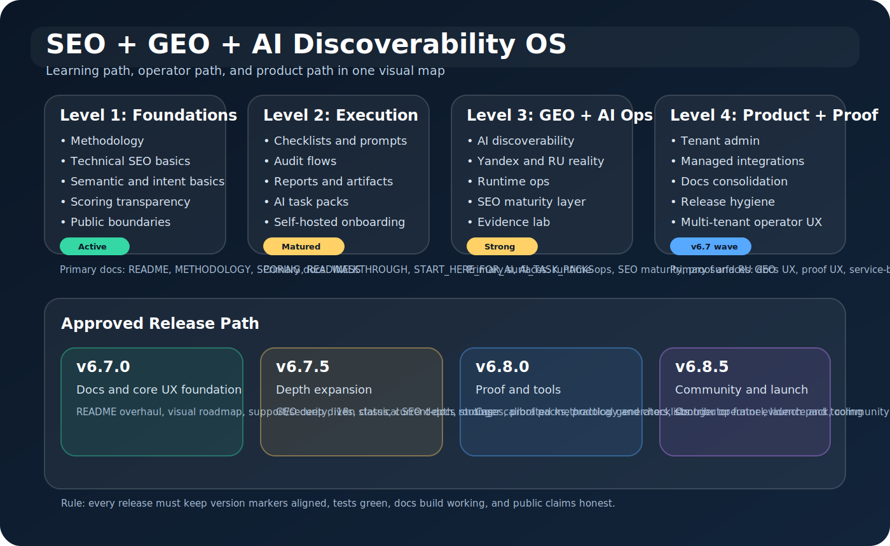

# SEO + GEO + AI Discoverability OS

[](https://github.com/Gudvin82/seo-geo-ai-roadmap/tags)
[](./LICENSE)
[](https://github.com/Gudvin82/seo-geo-ai-roadmap/commits/main)
[](https://github.com/Gudvin82/seo-geo-ai-roadmap/actions/workflows/markdown-lint.yml)
[](https://github.com/Gudvin82/seo-geo-ai-roadmap/actions/workflows/script-smoke-tests.yml)
[](https://github.com/Gudvin82/seo-geo-ai-roadmap/actions/workflows/python-tests.yml)
[](https://github.com/Gudvin82/seo-geo-ai-roadmap/actions/workflows/docs-site.yml)
[](https://github.com/Gudvin82/seo-geo-ai-roadmap/actions/workflows/security-scans.yml)
[](./docker-compose.yml)
[](./app/backend/app/main.py)


[🇷🇺 Русская версия](./README_RU.md) | [🇬🇧 English alias](./README_EN.md) | [Docs map](./DOCS_INDEX.md)

Free, transparent, self-hosted platform for SEO, GEO, and AI discoverability.

It combines:

- a methodology layer
- a real app layer
- scripts and validation helpers
- AI-agent task packs
- bilingual operator and client-delivery flows

## Table Of Contents

- [What This Is](#what-this-is)
- [Who It Is For](#who-it-is-for)
- [Visual Roadmap](#visual-roadmap)
- [Quick Start In 5 Minutes](#quick-start-in-5-minutes)
- [How To Use The Repository](#how-to-use-the-repository)
- [Learning Paths](#learning-paths)
- [Tools And Resources](#tools-and-resources)
- [Cases And Proof](#cases-and-proof)
- [Contributing And Support](#contributing-and-support)
- [Project Roadmap](#project-roadmap)
- [FAQ](#faq)
- [License](#license)

## What This Is

This repo is a connected system with three layers:

1. Framework
   Methodology, playbooks, prompts, checklists, templates, and scripts.
2. Platform
   Self-hosted FastAPI app with auth, workspaces, projects, audits, reports,
   scanner flows, exports, and integrations.
3. Service system
   A repeatable way to audit, prioritize, fix, verify, and re-run.

Read the boundaries before making public claims:

- [PUBLIC_PRODUCT_READINESS.md](./PUBLIC_PRODUCT_READINESS.md)
- [WHAT_THIS_PROJECT_IS.md](./WHAT_THIS_PROJECT_IS.md)
- [WHAT_THIS_PROJECT_IS_NOT.md](./WHAT_THIS_PROJECT_IS_NOT.md)
- [METHODOLOGY.md](./METHODOLOGY.md)
- [SCORING_EXPLAINED.md](./SCORING_EXPLAINED.md)

## Who It Is For

Best fit:

- agencies running recurring client audits
- in-house SEO, content, GEO, and AI teams
- founders building discoverability systems for their own sites
- AI coding agents that need a clear repo-to-audit-to-delivery path

Not the right fit:

- teams expecting a maintainer-operated hosted SaaS
- users who want black-box automation with no human review
- anyone treating GEO as a replacement for technical SEO and content quality

## Visual Roadmap

The current learning and execution path is shown here:



Supporting docs:

- [DOCS_INDEX.md](./DOCS_INDEX.md)
- [ROADMAP.md](./ROADMAP.md)
- [docs/i18n-status.md](./docs/i18n-status.md)

## Quick Start In 5 Minutes

### 1. Read the right entrypoint

- Human operator: [WALKTHROUGH.md](./WALKTHROUGH.md)
- AI coding agent: [START_HERE_FOR_AI.md](./START_HERE_FOR_AI.md)
- Service builder: [ONE_DAY_SERVICE_BLUEPRINT.md](./ONE_DAY_SERVICE_BLUEPRINT.md)

### 2. Choose one practical path

- Audit a site: [AI_TASK_PACKS.md](./AI_TASK_PACKS.md)
- Learn the system: [METHODOLOGY.md](./METHODOLOGY.md)
- Deploy the stack: [DEPLOYMENT.md](./DEPLOYMENT.md)
- Validate the stack: [VERIFY_DEPLOYMENT.md](./VERIFY_DEPLOYMENT.md)

### 3. Run a local proof path

```bash
make turnkey-demo
make verify-demo
```

### 4. Review one public proof path

- [REAL_CASES.md](./REAL_CASES.md)
- [docs/en/v600-case-anmalishev-audit.md](./docs/en/v600-case-anmalishev-audit.md)

## How To Use The Repository

There are three safe use modes:

1. Manual framework use
   Read the docs, playbooks, prompts, checklists, and apply them yourself.
2. AI-agent-assisted audit and delivery
   Give the repo to Cursor, Claude Code, Codex, VS Code, or a similar agent.
3. Self-hosted product foundation
   Deploy the platform under your own control and use it as the basis for your
   own audit or scanner service.

See the exact wording:

- [PUBLIC_PRODUCT_READINESS.md](./PUBLIC_PRODUCT_READINESS.md)
- [SUPPORT.md](./SUPPORT.md)
- [SECURITY.md](./SECURITY.md)

## Learning Paths

### Path A: Learn The Methodology

1. [METHODOLOGY.md](./METHODOLOGY.md)
2. [SCORING_EXPLAINED.md](./SCORING_EXPLAINED.md)
3. [docs/en/technical-seo-deep-playbook.md](./docs/en/technical-seo-deep-playbook.md)
4. [docs/en/geo-ai-operations-playbook.md](./docs/en/geo-ai-operations-playbook.md)

### Path B: Run Real Work

1. [WALKTHROUGH.md](./WALKTHROUGH.md)
2. [AI_TASK_PACKS.md](./AI_TASK_PACKS.md)
3. [REAL_CASES.md](./REAL_CASES.md)
4. `make turnkey-demo`

### Path C: Use With An AI Agent

1. [START_HERE_FOR_AI.md](./START_HERE_FOR_AI.md)
2. [AGENTS.md](./AGENTS.md)
3. [AI_TASK_PACKS.md](./AI_TASK_PACKS.md)
4. [prompts/en/repo-site-audit-agent-prompt.md](./prompts/en/repo-site-audit-agent-prompt.md)

### Path D: Build Your Own Service

1. [ONE_DAY_SERVICE_BLUEPRINT.md](./ONE_DAY_SERVICE_BLUEPRINT.md)
2. [ONE_CLICK_DEPLOY_OPTIONS.md](./ONE_CLICK_DEPLOY_OPTIONS.md)
3. [DEPLOYMENT.md](./DEPLOYMENT.md)
4. [PUBLIC_PRODUCT_READINESS.md](./PUBLIC_PRODUCT_READINESS.md)

## Tools And Resources

Current practical tools and helper paths:

- `/api/v1/settings/seo-intelligence-center`
- `scripts/checklist_generator.py`
- `scripts/semantic_gap_mapper.py`
- `scripts/proof_pack_builder.py`
- `scripts/case_library_builder.py`
- `scripts/synthetic_case_builder.py`
- `scripts/issue_pack_generator.py`
- `scripts/keyword_research_stub.py`
- `scripts/competitor_intelligence_stub.py`
- `scripts/backlink_intelligence_stub.py`
- `scripts/rank_tracking_stub.py`
- `scripts/release_hygiene_check.py`
- `scripts/version_consistency_check.py`

Key repo resources:

- [DOCS_INDEX.md](./DOCS_INDEX.md)
- [DOCS_ARCHIVE.md](./DOCS_ARCHIVE.md)
- [CONTRIBUTING.md](./CONTRIBUTING.md)
- [ROADMAP.md](./ROADMAP.md)
- [docs/i18n-status.md](./docs/i18n-status.md)

## Cases And Proof

Core evidence path:

- [REAL_CASES.md](./REAL_CASES.md)
- [anmalishev.ru public audit case](./docs/en/v600-case-anmalishev-audit.md)
- [anmalishev.ru before/after case](./docs/en/v430-case-anmalishev.md)
- [auditguard.ru + sitepravo.ru case](./docs/en/v430-case-auditguard-sitepravo.md)

Important rule:

- treat public proof as bounded evidence, not universal guarantees
- separate facts, inferences, and operator judgment

## Contributing And Support

- Contribution guide: [CONTRIBUTING.md](./CONTRIBUTING.md)
- Code of conduct: [CODE_OF_CONDUCT.md](./CODE_OF_CONDUCT.md)
- Support path: [SUPPORT.md](./SUPPORT.md)
- Security reporting: [SECURITY.md](./SECURITY.md)

## Project Roadmap

The active release path is:

- `v6.7.0`: docs and core UX foundation
- `v6.7.5`: operator tools for checklists, semantic mapping, and proof packs
- `v6.8.0`: proof, case library, synthetic training packs, and issue-pack maturity
- `v6.8.5`: community, launch, and contributor growth layer

Read the full plan:

- [ROADMAP.md](./ROADMAP.md)

## FAQ

### Is this already a public hosted SaaS?

No. It is a free self-hosted platform and product foundation, not a
maintainer-operated hosted service.

### Can I give this repo to an AI coding agent?

Yes. That is a first-class supported use mode.

### Does this replace classic SEO?

No. GEO and AI discoverability are a higher layer on top of technical SEO,
semantic coverage, authority, trust, and conversion clarity.

### Is every integration fully production-ready and zero-touch?

No. Some integrations are already stronger and more operational than others.
Use the repo's runtime, readiness, and proof layers honestly.

## v6.8.0 focus

`v6.8.0` strengthens the proof, case-library, and working-tool layer so the
repository is easier to use for public evidence, training, and implementation
handoff.

It adds:

- `scripts/case_library_builder.py`
- `scripts/synthetic_case_builder.py`
- `scripts/issue_pack_generator.py`
- [Synthetic Cases](./docs/en/synthetic-cases.md)
- [Issue Pack Workflow](./docs/en/issue-pack-workflow.md)

## License

See [LICENSE](./LICENSE).
