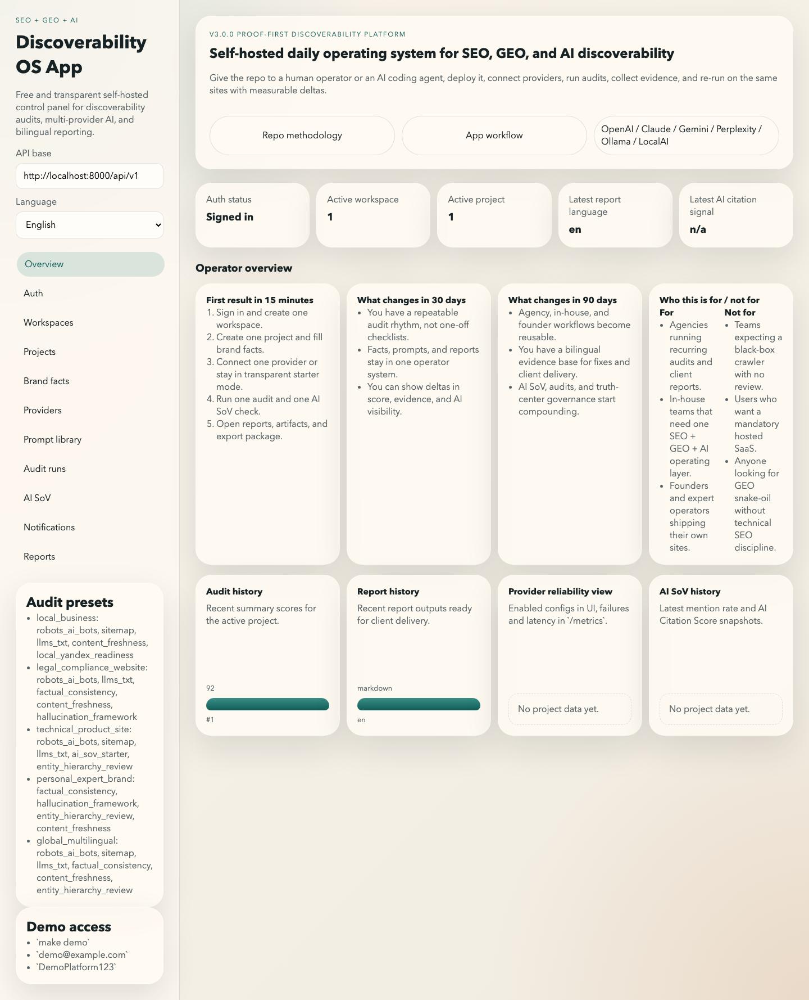
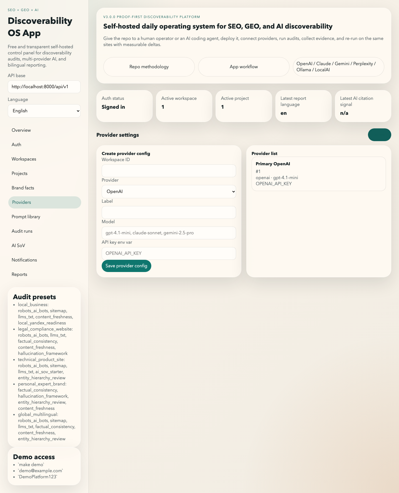
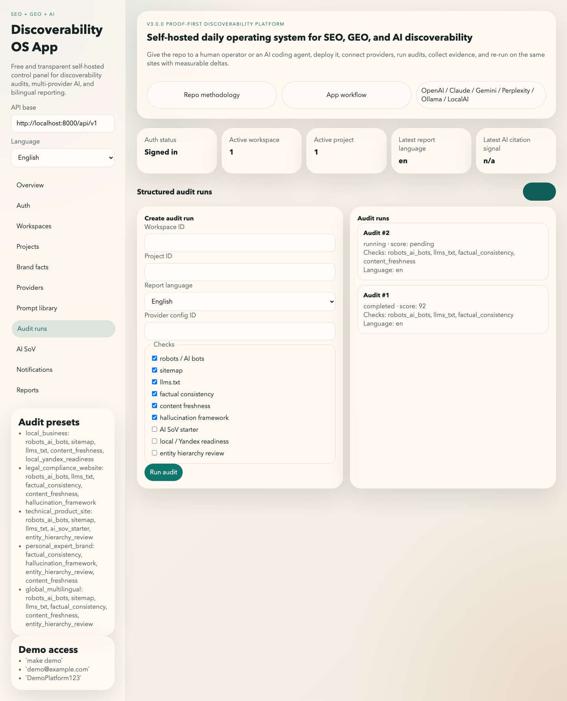
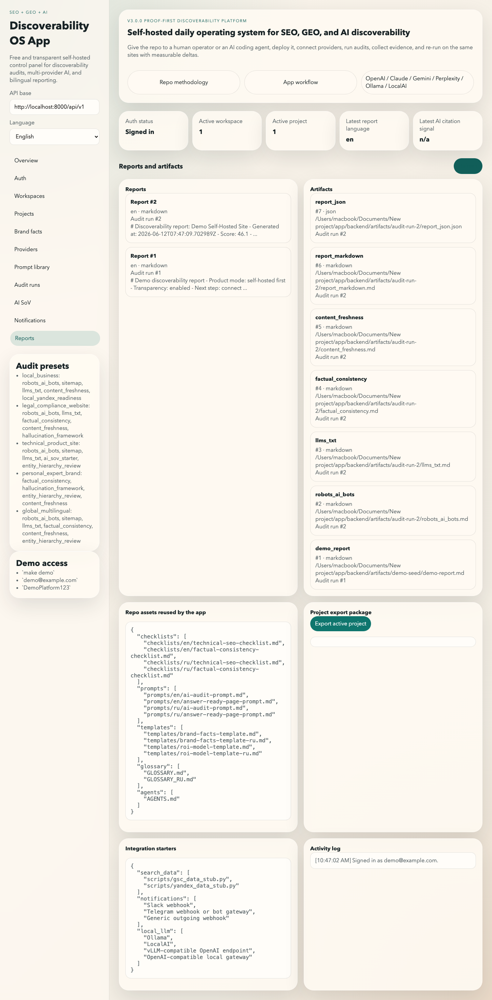

# SEO + GEO + AI Discoverability OS

[](https://github.com/Gudvin82/seo-geo-ai-roadmap/tags)
[](./LICENSE)
[](https://github.com/Gudvin82/seo-geo-ai-roadmap/commits/main)
[](https://github.com/Gudvin82/seo-geo-ai-roadmap/blob/main/.github/workflows/markdown-lint.yml)
[](https://github.com/Gudvin82/seo-geo-ai-roadmap/blob/main/.github/workflows/script-smoke-tests.yml)
[](https://github.com/Gudvin82/seo-geo-ai-roadmap/blob/main/.github/workflows/python-tests.yml)
[](https://github.com/Gudvin82/seo-geo-ai-roadmap/blob/main/.github/workflows/docs-site.yml)
[](https://github.com/Gudvin82/seo-geo-ai-roadmap/blob/main/.github/workflows/security-scans.yml)
[](https://github.com/Gudvin82/seo-geo-ai-roadmap/blob/main/.github/workflows/python-tests.yml)
[](./docker-compose.yml)
[](./app/backend/app/main.py)


Free, transparent, self-hosted platform for SEO, GEO, and AI discoverability.
Deploy it on your own machine or server, connect your own AI providers, run
audits, track AI share of voice, manage brand facts, and deliver bilingual
reports without mandatory paid cloud.

[Русская версия](./README_RU.md)

## What this is

This repository has three connected layers:

- Framework: the methodology, prompts, templates, checklists, and scripts
- Platform: the self-hosted app for operators, teams, and client delivery
- Service system: the repeatable way to audit, prioritize, fix, and re-run

The differentiator is not "more docs". It is one practical system that a human
operator or an AI coding agent can use end to end:

1. deploy
2. connect provider(s)
3. run a real audit
4. generate reports and artifacts
5. prioritize fixes
6. re-run and compare deltas over time

## Who it is for

- Agencies running recurring audits and client-ready reporting
- In-house SEO, growth, content, and AI operations teams
- Founders and expert operators managing their own multilingual sites
- Teams working across English and Russian-speaking markets

## Who it is not for

- Teams expecting a black-box crawler with no human review
- Users who only want a hosted SaaS with no self-hosted option
- People looking for GEO hype as a replacement for technical SEO
- Buyers who want rankings promised without proof, evidence, or governance

## What happens in 15 minutes, 30 days, and 90 days

### In 15 minutes

- clone the repo
- run the stack
- sign in
- create one workspace and one project
- connect one provider or stay in transparent starter mode
- run one audit and one AI SoV check
- open a report and export package

### In 30 days

- you move from one-off audits to a repeatable operating rhythm
- brand facts, prompts, and evidence stay in one place
- you can show score and visibility deltas to yourself or clients

### In 90 days

- you build a reusable operator system instead of ad hoc SEO work
- AI SoV, factual consistency, and reporting become measurable routines
- agency, in-house, and founder modes can share the same platform

## Outcome-based scenarios

- Agency mode: one workspace per client, one project per site, repeatable
  bilingual reporting, AI-assisted prioritization, exportable artifacts
- In-house mode: one truth center, recurring audits, provider-backed AI SoV,
  evidence-driven backlog for product, content, and engineering
- Founder mode: one self-hosted stack for site audits, AI visibility checks,
  fact governance, and periodic re-runs without vendor lock-in

## Start here

- Human quickstart: [WALKTHROUGH.md](./WALKTHROUGH.md)
- AI quickstart: [START_HERE_FOR_AI.md](./START_HERE_FOR_AI.md)
- Deployment: [DEPLOYMENT.md](./DEPLOYMENT.md)
- Verification: [VERIFY_DEPLOYMENT.md](./VERIFY_DEPLOYMENT.md)
- API reference: [docs/en/api-reference.md](./docs/en/api-reference.md)
- Hosted validator: [docs site validator](./docs_site/validator.md)
- Scanner foundation: [docs/en/public-scanner-v360.md](./docs/en/public-scanner-v360.md)
- Discoverability coverage: [docs/en/discoverability-coverage-v370.md](./docs/en/discoverability-coverage-v370.md)
- AI guidance file: [docs/en/ai-txt.md](./docs/en/ai-txt.md)
- Command surface: [docs/en/command-catalog-v340.md](./docs/en/command-catalog-v340.md)
- v3.8 command UX: [docs/en/command-catalog-v380.md](./docs/en/command-catalog-v380.md)
- Graph intelligence: [docs/en/graph-intelligence-v380.md](./docs/en/graph-intelligence-v380.md)
- GTM and distribution: [docs/en/distribution-and-gtm-v380.md](./docs/en/distribution-and-gtm-v380.md)
- Research loop: [docs/en/research-build-improve-repeat-v380.md](./docs/en/research-build-improve-repeat-v380.md)
- Framework integrations: [docs/en/framework-integrations-v380.md](./docs/en/framework-integrations-v380.md)
- Integration production flows: [docs/en/integration-production-flows-v380.md](./docs/en/integration-production-flows-v380.md)
- v4.2 production proof: [docs/en/v420-production-proof.md](./docs/en/v420-production-proof.md)
- Product modes: [docs/en/product-modes-v380.md](./docs/en/product-modes-v380.md)
- CI gating: [docs/en/ci-gating-v380.md](./docs/en/ci-gating-v380.md)
- Executive dashboard: [docs/en/executive-dashboard-v380.md](./docs/en/executive-dashboard-v380.md)
- AI Agent Mode: [docs/en/ai-agent-mode-v400.md](./docs/en/ai-agent-mode-v400.md)
- Product surfaces: [docs/en/product-surfaces-v400.md](./docs/en/product-surfaces-v400.md)
- Managed API boundary: [docs/en/managed-api-v400.md](./docs/en/managed-api-v400.md)
- Extensions and automation: [docs/en/extensions-and-automation-v400.md](./docs/en/extensions-and-automation-v400.md)
- Bootstrap guide: [docs/en/bootstrap-guide-v340.md](./docs/en/bootstrap-guide-v340.md)
- Architecture note: [ARCHITECTURE_NOTE.md](./ARCHITECTURE_NOTE.md)
- Evaluation kit: [EVALUATE_THIS_REPO.md](./EVALUATE_THIS_REPO.md)
- Evaluate first prompt: [EVALUATE_THIS_REPO_FIRST.md](./EVALUATE_THIS_REPO_FIRST.md)
- Commercial boundary: [COMMERCIAL_ROADMAP.md](./COMMERCIAL_ROADMAP.md)

## What `v4.0.0` introduced

## What `v4.1.0` adds

- hardened scan-job access control for tasks and graph runtime so scanner sessions stay private by default
- redirect-aware scanner fetch and webhook protection with public-port and response-size limits
- recoverable DB-backed scan worker semantics instead of thread-only fire-and-forget execution
- governed CMS change requests with preview → approve → apply → verify → rollback lifecycle
- report assistant follow-up endpoint and app surface for operator Q&A on stored reports
- stronger production-flow and CI-readiness planning for GSC, GA4, Yandex, and CMS integrations
- sharper scanner / product-app / repo-operator separation plus expanded machine-readable contracts
- trusted delivery targets plus PR proposal generation with auto-merge eligibility flags for trusted repositories
- real Telegram webhook runtime, richer Chrome and VS Code operator packages, and a managed-cloud Kubernetes pack

## What `v4.2.0` adds

- AI readability auditing for visible structure, machine-readable guidance layers, and answer-ready support
- heuristic citability scoring with machine-readable breakdown and quick wins
- CDN or edge checks for GPTBot, ClaudeBot, and PerplexityBot blocking
- RAG chunk-readiness checks for long sections, heading depth, and definition-style content
- CrUX field-data path plus a new integration verification matrix endpoint
- wider provider coverage: OpenAI, Anthropic, Gemini, Perplexity, Mistral, Cohere, DeepSeek, xAI or Grok, Ollama, LocalAI, and vLLM
- stack packs for WordPress, React, and Angular
- optional Lighthouse CI path for PR-level synthetic gating

## What `v4.0.0` adds

- real AI Agent Mode contract, overview, and run surfaces with safe action boundaries
- one-click URL audit result flow with direct links into task generation and graph runtime
- normalized task bundles plus export adapters, including a real GitHub Issues path
- dynamic graph intelligence generated from live scan or audit data instead of static-only demos
- explicit managed/public API boundary and stronger machine-readable contracts in `contracts/*.schema.json`
- first-class GitHub Action path plus honest VS Code, Chrome, and Telegram scaffolds
- sharper scanner / product-app / repo-operator surface separation across docs, app, and API

## What `v3.8.0` adds

- canonical `/geo ...` command UX with aliases, examples, outputs, and use-case packaging
- interactive graph intelligence layer for site structure, discoverability surfaces, issue dependencies, and trust mapping
- stronger distribution and GTM packaging for agencies, founders, consultants, and in-house teams
- clearer research → build → improve → re-measure operating loop
- reporting packs for executive summaries, fix packs, and graph snapshots
- clearer framework integration guidance for self-hosted scanner and delivery flows
- production-guided GSC, Yandex, and CMS contracts with CI-aware next steps
- fuller executive dashboard and sharper separation between repo, app, and scanner modes

## What `v3.3.0` adds

- hosted or deploy-ready `llms.txt` validator surface
- explicit retry and terminal failure semantics
- usable scheduling modes for recurring checks
- safer CMS writeback boundary with review-first execution
- security scanning and coverage generation in CI
- fact drift, trust surface, ROI, and executive reporting docs
- public evaluation and proof-review assets

## What `v3.4.0` adds

- GEO command surface for AI agents and operators
- command-router API plus CLI routing script
- self-hosted bootstrap planner for demo and production-like setup
- clearer modular "how it works" and scoring-model docs
- stronger adoption surface without giving up self-hosted-first honesty

## What `v3.5.0` adds

- built-in AI handoff task packs so users do not need to write their own prompt
- scanner-oriented bootstrap mode for teams building a client-facing intake surface
- public architecture note in EN and RU describing deployment, audit flow, and scanner evolution
- command-catalog expansion for `deploy` and `scanner` use cases

## What `v3.7.0` adds

- real RU/Yandex AI hardening with `YandexAdditional` as a distinct policy surface
- practical `ai.txt` validation and contradiction review against `robots.txt` and `llms.txt`
- structured data coverage auditing with `WebSite` schema support
- heuristic FAQ / answer-ready detection for real pages
- Open Graph and Twitter Card completeness checks for discoverability hygiene
- integrated `robots.txt` ↔ sitemap linkage verification
- RU AI-content marking guidance framed as practical compliance, not legal advice

## What `v3.6.0` adds

- dedicated scanner intake page for passive, active, and feature-flagged full scans
- ownership verification plus consent flow for active scanning
- async scan jobs with status, events, cancellation, and artifact visibility
- versioned JSON, markdown, CSV, and HTML export artifacts plus completion hooks
- public-service limitations surfaced in UI and docs before scan launch

## AI handoff block

Give this repository to your AI coding agent and tell it:

1. read [START_HERE_FOR_AI.md](./START_HERE_FOR_AI.md)
2. follow [AGENTS.md](./AGENTS.md)
3. run `python scripts/geo_command_surface.py catalog`
4. run `python scripts/agent_handoff_pack.py --task deploy-demo --language en`
5. run `python scripts/bootstrap_self_hosted.py --mode demo --format markdown`
6. run `make turnkey-demo`
7. run `make agent-self-check`
8. if scanner intake is needed, open `app/frontend/scanner.html` and follow the built-in verification and status flow
9. if explanation or prioritization is needed, open `app/frontend/graph.html` and use `/geo graph`
10. report what was verified, what was simulated, and what still needs human
   review

The repository is intentionally structured so an AI agent can deploy it from
scratch and keep the EN/RU operator layer aligned.

## Product proof

These screenshots are from the actual local app flow, not placeholder diagrams.
If you need a live demo, use the local demo flow below. No always-on public SaaS
demo is promised in this repository.






## Why this repository exists

Most SEO repositories stop at advice. Most GEO discussions stop at theory. Most
AI tooling hides the scoring, forces a cloud dependency, or ignores Russian
markets. This project is built for the opposite direction:

- self-hosted first
- transparent metrics
- bilingual from day one
- human-usable and AI-agent-usable
- proof before claims
- technical SEO plus GEO/AI, not GEO instead of SEO

## What is inside

- App layer: [`app`](./app)
- Docs: [`docs/en`](./docs/en) and [`docs/ru`](./docs/ru)
- Checklists: [`checklists`](./checklists)
- Prompt library: [`prompts`](./prompts)
- Templates: [`templates`](./templates)
- Examples: [`examples`](./examples)
- Scripts: [`scripts`](./scripts)
- Architecture: [ARCHITECTURE.md](./ARCHITECTURE.md)
- Public architecture note: [ARCHITECTURE_NOTE.md](./ARCHITECTURE_NOTE.md)
- Positioning: [POSITIONING.md](./POSITIONING.md)
- Real cases: [REAL_CASES.md](./REAL_CASES.md)
- Operations runbook: [OPERATIONS_RUNBOOK.md](./OPERATIONS_RUNBOOK.md)
- Known limitations: [KNOWN_LIMITATIONS.md](./KNOWN_LIMITATIONS.md)

## App quickstart

- Frontend: `http://localhost:3000`
- API docs: `http://localhost:8000/docs`
- ReDoc: `http://localhost:8000/redoc`
- Health: `http://localhost:8000/healthz`
- Readiness: `http://localhost:8000/readyz`
- Metrics: `http://localhost:8000/metrics`

### Turnkey local demo

```bash
make turnkey-demo
make verify-demo
make agent-self-check
```

Expected demo credentials:

- Email: `demo@example.com`
- Password: `DemoPlatform123`

## Canonical operator flow

1. Create workspace
2. Create project
3. Fill brand facts
4. Configure providers
5. Run audit
6. Open report and artifacts
7. Run AI SoV
8. Prioritize fixes
9. Re-run after changes
10. Export client or internal delivery pack

## Transparent scoring and implementation output

`v3.2.0` makes the GEO/AI layer more decision-grade:

- three explicit outcome layers: rankings, AI visibility, and conversion trust
- measurement maturity framing so proxy metrics are not sold as absolute truth
- priority maps, AI-surface playbooks, RU LLM context, and anti-hype guardrails
- linkable operator tool: standalone `llms.txt` validator backed by public API

`v3.3.0` adds the operational proof layer:

- hosted/deploy-ready validator page through the docs site
- retry semantics for provider calls, notifications, and governed CMS preparation
- documented recurring execution model for scheduled checks
- fact drift detection, trust-surface mapping, executive summaries, and ROI framing
- clearer commercial boundary and public evaluation flow

`v3.0.0` formalized two proof-first layers:

- AI Citation Score: a transparent 0-100 signal based on whether a brand is
  mentioned, cited, and described well in structured AI SoV checks
- Prioritization engine: impact, effort, confidence, and benchmark status for
  findings such as LCP, CLS, INP, schema coverage, factual consistency, and AI
  readiness

Read more:

- [docs/en/ai-citation-score.md](./docs/en/ai-citation-score.md)
- [docs/en/api-reference.md](./docs/en/api-reference.md)
- [docs/en/patch-mode.md](./docs/en/patch-mode.md)
- [docs/en/client-delivery.md](./docs/en/client-delivery.md)
- [docs/en/search-data-connectors.md](./docs/en/search-data-connectors.md)
- [docs/en/cms-connectors.md](./docs/en/cms-connectors.md)
- [docs/en/geo-measurement-maturity.md](./docs/en/geo-measurement-maturity.md)
- [docs/en/geo-priority-maps.md](./docs/en/geo-priority-maps.md)
- [docs/en/geo-ai-surfaces.md](./docs/en/geo-ai-surfaces.md)
- [docs/en/answer-ready-patterns.md](./docs/en/answer-ready-patterns.md)
- [docs/en/entity-seo-and-kg.md](./docs/en/entity-seo-and-kg.md)
- [docs/en/geo-red-team-and-risks.md](./docs/en/geo-red-team-and-risks.md)
- [docs/en/llms-validator.md](./docs/en/llms-validator.md)
- [docs/en/ai-visibility-check-action.md](./docs/en/ai-visibility-check-action.md)
- [docs/en/telegram-sov-alerts.md](./docs/en/telegram-sov-alerts.md)
- [app/frontend/llms-validator.html](./app/frontend/llms-validator.html)

## Real cases

`v3.0.0` expands the real-case layer with bounded, honest public-site snapshots
for:

- `sitepravo.ru`
- `auditguard.ru`
- `anmalishev.ru`

See [REAL_CASES.md](./REAL_CASES.md).

## Verification discipline

Use these commands before treating a release as complete:

- `make verify-demo`
- `make agent-self-check`
- `PYTHONPATH=app/backend ./.venv/bin/python -m pytest app/backend/tests`
- `./.venv/bin/python -m mkdocs build`

## Honest boundaries

This project is not claiming:

- full autonomous remediation with no human review
- guaranteed AI citations across volatile AI answer surfaces
- enterprise SLA, SSO, or billing in the current release
- replacement of technical SEO with GEO alone

See [KNOWN_LIMITATIONS.md](./KNOWN_LIMITATIONS.md).

## Latest changes

- `v4.1.0`: security hardening, recoverable scanner execution, governed CMS lifecycle,
  report assistant, trusted delivery targets, Telegram webhook runtime, repo-ready
  Chrome/VS Code packages, and managed cloud deployment assets
- `v4.0.0`: AI Agent Mode, one-click URL audit result flow, task generation and export,
  dynamic graph runtime, managed API boundary, contracts catalog, GitHub Action path,
  and VS Code / Chrome / Telegram scaffolds
- `v3.6.0`: dedicated scanner intake page, ownership verification and consent flow,
  async scan jobs, versioned export artifacts, notification hooks, and public
  limitations in UI and docs
- `v3.5.0`: built-in AI handoff task packs, scanner-oriented bootstrap mode,
  public EN/RU architecture notes, and command-surface expansion for deploy
  and scanner scenarios
- `v3.4.0`: GEO command surface, command-router API, bootstrap planner, modular
  how-it-works docs, scoring-model clarification, and stronger AI/operator
  onboarding
- `v3.3.0`: hosted/deploy-ready validator page, retry and scheduling docs,
  fact-drift starter implementation, safer CMS writeback boundary, security
  scans, coverage artifacts, governance docs, executive reporting assets, and
  public evaluation surfaces
- `v3.2.0`: GEO/AI deep-dive docs, measurement maturity, priority maps,
  AI-surface playbooks, answer-ready and entity/KG layers, anti-hype docs,
  RU LLM guidance, `llms.txt` validator, AI Visibility Check example, and
  expanded JSON-LD templates
- `v3.1.0`: search and analytics integration starters, CMS connector flows,
  patch packs, client delivery packs, project package import, stronger
  white-label framing, review-mode guidance, and richer EN/RU operator docs
- `v3.0.0`: proof-first positioning rewrite, stronger onboarding, real app
  screenshots, AI Citation Score documentation, prioritization engine,
  provider-backed AI SoV, structured observability, role/invite hardening, and
  richer EN/RU operator docs
- `v2.3.0`: AI SoV persistence, prompt library metadata, webhook notifications,
  project export package, top-20 local LLM matrix, benchmark and search-data
  documentation
- `v2.2.0`: operator-ready platform upgrade with permissions, invites, and
  verify-demo discipline

## License

This repository is distributed under the license defined in [LICENSE](./LICENSE).
