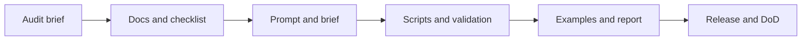

# Walkthrough

## Where to start

1. Read [README.md](./README.md) for positioning.
2. Read [AGENTS.md](./AGENTS.md) for execution defaults.
3. Open [docs/en/01-audit.md](./docs/en/01-audit.md).
4. Choose the matching checklist.
5. Run the supporting scripts.

## How the repository works in practice



## Typical live-project flow

1. Run an audit with docs plus checklist.
2. Map pages, proof assets, and entity structure.
3. Generate or validate `llms.txt`, `robots.txt`, and ROI assumptions.
4. Review factual consistency and entity hierarchy.
5. Publish and re-check with the validation scripts.

## Working with AI coding agents

- start with [AGENTS.md](./AGENTS.md)
- use examples before inventing new structures
- run tests in `tests/`
- keep README, scripts docs, and examples aligned

## Local docs-site preview

```bash
pip install mkdocs-material
mkdocs serve
```

If GitHub Pages does not render as expected:

- run `mkdocs build` locally
- check `mkdocs.yml` navigation paths
- confirm the Pages workflow ran on `main`
