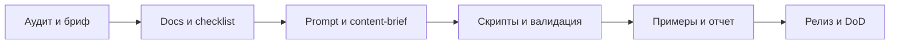

# Пошаговый Разбор

## С чего начать

1. Прочитайте [README_RU.md](./README_RU.md) для positioning.
2. Прочитайте [AGENTS.md](./AGENTS.md) для execution defaults.
3. Откройте [docs/ru/01-audit.md](./docs/ru/01-audit.md).
4. Выберите подходящий чеклист.
5. Запустите supporting-скрипты.

## Как репозиторий работает на практике



## Типовой поток для живого проекта

1. Проведите аудит через docs и checklist.
2. Соберите карту страниц, proof-активов и entity structure.
3. Сгенерируйте или проверьте `llms.txt`, `robots.txt` и ROI-гипотезы.
4. Проверьте factual consistency и entity hierarchy.
5. Публикуйте изменения и прогоняйте валидацию повторно.

## Работа с AI coding agents

- начинайте с [AGENTS.md](./AGENTS.md)
- используйте примеры до того, как изобретать новую структуру
- запускайте тесты из `tests/`
- держите в синхроне README, docs по скриптам и examples

## Локальный предпросмотр docs-site

```bash
pip install mkdocs-material
mkdocs serve
```

Если GitHub Pages отображается неправильно:

- локально прогоните `mkdocs build`
- проверьте пути в `mkdocs.yml`
- убедитесь, что workflow Pages отработал на `main`
