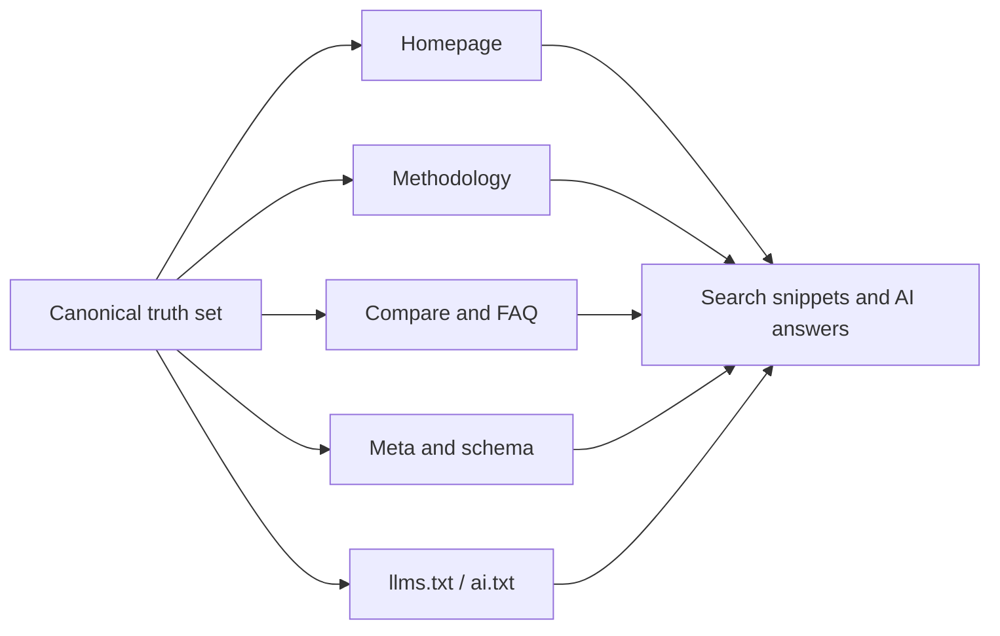

# Canonical Facts And Entity Consistency

## Why this matters

Factual drift happens when core claims about a brand or product stop matching
across public pages, metadata, schema, and AI-facing files. This is dangerous
for SEO, GEO, and AI answers because search engines and LLMs infer truth from
repetition, consistency, and source hierarchy.

## Where contradictions usually appear

- homepage value proposition and hero numbers
- methodology pages
- comparison pages
- FAQ
- title and meta description
- `llms.txt`
- `llms-full.txt`
- `ai.txt`
- schema

## Common examples of factual drift

- the homepage says `650+ checks`, while `llms.txt` says `570+`
- metadata claims `RU + EN`, while the site is effectively RU-only
- the public methodology says `11 directions`, while the FAQ says `16`
- schema marks an organization as global while the page copy says local-only

## Why it harms discoverability

- weakens trust signals for humans
- creates inconsistent snippets and AI summaries
- increases hallucination risk because models see multiple competing truths
- makes compare pages and methodology pages look less reliable

## Define a canonical truth set

Every serious site should maintain one explicit truth layer that governs:

- official brand name
- preferred short name
- core product or service scope
- supported languages and markets
- key numbers that appear publicly
- approved claims
- prohibited or uncertain claims
- related entities and hierarchy

Use a reusable source such as:

- [templates/brand-facts-template.md](../../templates/brand-facts-template.md)
- [templates/brand-facts-template-ru.md](../../templates/brand-facts-template-ru.md)

## Operational workflow

1. Define the canonical truth set.
2. Map every public surface where those facts appear.
3. Review homepage, methodology, compare, FAQ, schema, and AI-facing files.
4. Fix contradictions before shipping growth work.
5. Add a recurring review step whenever numbers or service scope change.

## Validation logic

- one fact should have one authoritative wording
- one number should have one approved public version
- one market claim should not contradict language coverage
- AI-facing files should mirror public site claims, not invent a better story

## Recommended assets

- [checklists/en/factual-consistency-checklist.md](../../checklists/en/factual-consistency-checklist.md)
- [examples/brand-facts-example.md](../../examples/brand-facts-example.md)
- [examples/hallucination-report-example.md](../../examples/hallucination-report-example.md)

## Factual consistency map

