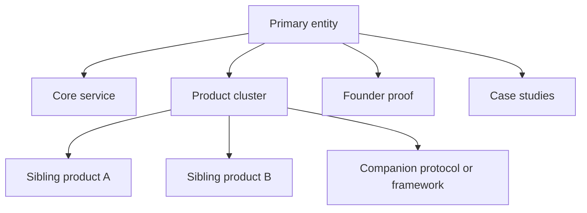

# Entity Hierarchy And Brand Focus

## Why this matters

As a project grows, discoverability degrades when users and AI systems cannot
tell what the primary entity is and how products, services, founder identity,
protocols, and case studies relate to each other.

## Core concepts

- primary entity: the main brand or person the site wants to rank and be cited
  for
- secondary entities: products, services, tools, case studies, or companion
  frameworks that support the primary entity
- expert brand vs product brand: the expert may be the trust anchor while the
  product becomes the conversion destination
- ecosystem architecture: the map that connects sibling products and shared
  authority

## Typical patterns

### Expert-led consulting hub

- primary entity: expert or founder
- secondary entities: services, products, case studies, articles
- risk: AI systems may flatten everything into one vague consultant narrative

### Product-led audit service

- primary entity: audit product
- secondary entities: issue library, methodology, founder proof, integrations
- risk: brand story becomes too tool-centric and loses trust context

### Multi-product ecosystem

- primary entity: ecosystem brand or founder brand
- secondary entities: sibling products with distinct use cases
- risk: users and LLMs confuse which product solves which problem

## When to split entities

Split more aggressively when:

- products serve different buyer intents
- products need different trust and proof layers
- language or market scope differs
- the same homepage cannot explain the hierarchy without confusion

## How to keep hierarchy clear

- define one primary entity per main entrypoint
- create explicit cross-links between founder, services, products, and cases
- keep naming stable across schema, metadata, and AI-facing files
- avoid mixing every offer into one hero section
- make sibling products comparable but clearly separate

## Entity hierarchy map

## Recommended assets

- [GLOSSARY.md](../../GLOSSARY.md)
- [REAL_CASES.md](../../REAL_CASES.md)
- [docs/en/canonical-facts-and-entity-consistency.md](./canonical-facts-and-entity-consistency.md)
