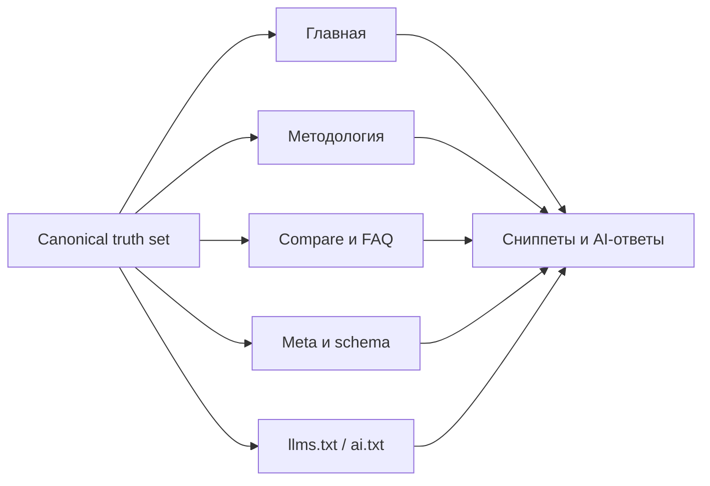

# Канонические Факты И Консистентность Сущности

## Почему это важно

Factual drift возникает, когда ключевые факты о бренде или продукте перестают
совпадать между публичными страницами, metadata, schema и AI-facing файлами.
Для SEO, GEO и AI-ответов это опасно, потому что поисковики и LLM выводят
"правду" из повторяемости, консистентности и иерархии источников.

## Где обычно появляются противоречия

- главная страница и hero-блок
- страницы методологии
- compare-страницы
- FAQ
- title и meta description
- `llms.txt`
- `llms-full.txt`
- `ai.txt`
- schema

## Типовые примеры factual drift

- на главной написано `650+ проверок`, а в `llms.txt` уже `570+`
- в metadata обещан рынок `RU + EN`, а публично сайт по факту RU-only
- методология говорит `11 направлений`, а FAQ уже `16`
- schema описывает сущность как global, а текст сайта подает ее как local-only

## Почему это вредит discoverability

- ослабляет доверие людей
- порождает противоречивые сниппеты и AI-summary
- повышает риск галлюцинаций, потому что модели видят несколько конкурирующих
  версий истины
- делает methodology и compare-страницы менее надежными

## Как определить canonical truth set

У каждого серьезного сайта должен быть явный truth-layer, который задает:

- официальное название бренда
- preferred short name
- ядро продукта или сервиса
- поддерживаемые языки и рынки
- ключевые публичные цифры
- approved claims
- prohibited или uncertain claims
- связанные сущности и их иерархию

Используйте как основу:

- [templates/brand-facts-template.md](../../templates/brand-facts-template.md)
- [templates/brand-facts-template-ru.md](../../templates/brand-facts-template-ru.md)

## Рабочий процесс

1. Зафиксируйте canonical truth set.
2. Составьте карту всех публичных поверхностей, где появляются эти факты.
3. Проверьте главную, методологию, compare, FAQ, schema и AI-файлы.
4. Исправляйте противоречия раньше, чем запускаете growth-работы.
5. Повторяйте проверку всякий раз, когда меняются цифры или scope сервиса.

## Логика валидации

- у одного факта должна быть одна каноническая формулировка
- у одной цифры должна быть одна approved public version
- рыночные claims не должны противоречить языковому покрытию
- AI-facing файлы должны отражать публичные claims, а не придумывать более
  красивую версию истории

## Рекомендуемые артефакты

- [checklists/ru/factual-consistency-checklist.md](../../checklists/ru/factual-consistency-checklist.md)
- [examples/brand-facts-example.md](../../examples/brand-facts-example.md)
- [examples/hallucination-report-example.md](../../examples/hallucination-report-example.md)

## Карта консистентности фактов

