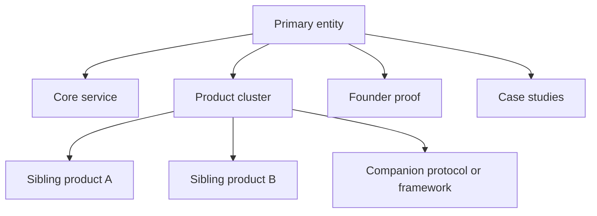

# Иерархия Сущностей И Фокус Бренда

## Почему это важно

По мере роста проекта discoverability начинает деградировать, если пользователи
и AI не понимают, кто здесь primary entity и как связаны продукты, сервисы,
личный бренд, протоколы и кейсы.

## Ключевые понятия

- primary entity: главный бренд или человек, по которому сайт хочет ранжироваться
  и цитироваться
- secondary entities: продукты, сервисы, инструменты, кейсы или companion
  frameworks, которые поддерживают primary entity
- expert brand vs product brand: эксперт может быть trust-anchor, а продукт —
  conversion destination
- ecosystem architecture: карта, связывающая sibling-products и shared authority

## Типовые паттерны

### Экспертный consulting hub

- primary entity: эксперт или фаундер
- secondary entities: услуги, продукты, кейсы, статьи
- риск: AI сплющит все в размытую историю про "какого-то консультанта"

### Product-led audit service

- primary entity: аудит-продукт
- secondary entities: issue library, methodology, founder proof, integrations
- риск: бренд станет слишком tool-centric и потеряет trust-контекст

### Multi-product ecosystem

- primary entity: ecosystem brand или founder brand
- secondary entities: sibling-продукты с разными use case
- риск: пользователи и LLM будут путать, какой продукт решает какую задачу

## Когда разделять сущности

Разделяйте их явнее, если:

- продукты обслуживают разные buyer intent
- продуктам нужны разные trust и proof layers
- различаются язык или рынок
- одна главная уже не может объяснить иерархию без путаницы

## Как удерживать иерархию ясной

- задавайте одну primary entity на один главный entrypoint
- делайте явные cross-links между founder, services, products и cases
- держите naming стабильным в schema, metadata и AI-facing файлах
- не смешивайте все офферы в одном hero-блоке
- делайте sibling-продукты сравнимыми, но четко разделенными

## Карта иерархии сущностей

## Рекомендуемые материалы

- [GLOSSARY_RU.md](../../GLOSSARY_RU.md)
- [REAL_CASES_RU.md](../../REAL_CASES_RU.md)
- [docs/ru/canonical-facts-and-entity-consistency.md](./canonical-facts-and-entity-consistency.md)
